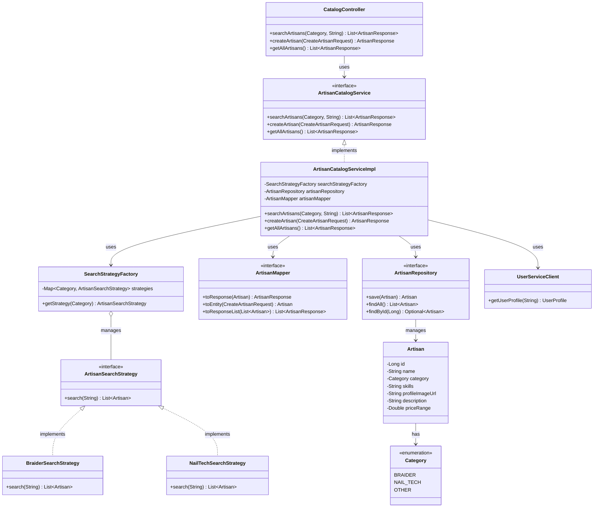

# CatalogService Architecture

The following diagram illustrates the architecture of the `CatalogService`, showing the relationships between controllers, services, repositories, models, and strategy patterns.

